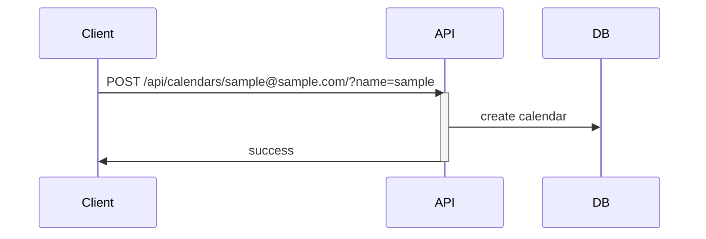
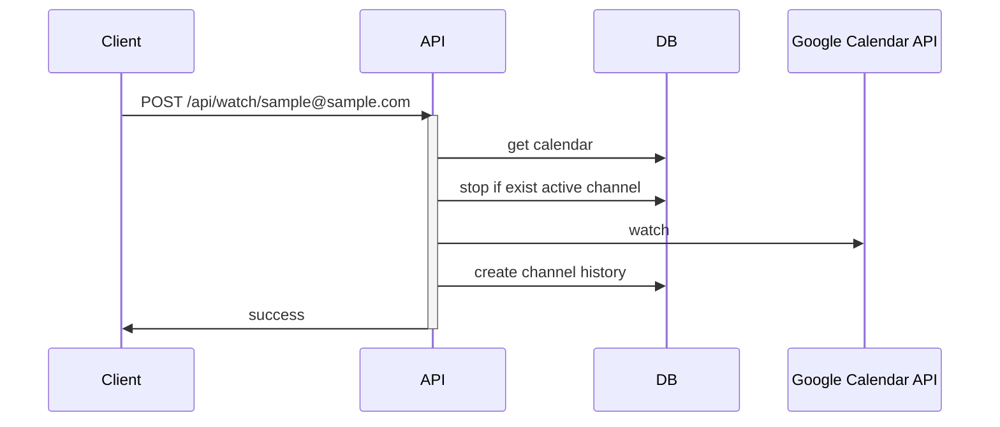
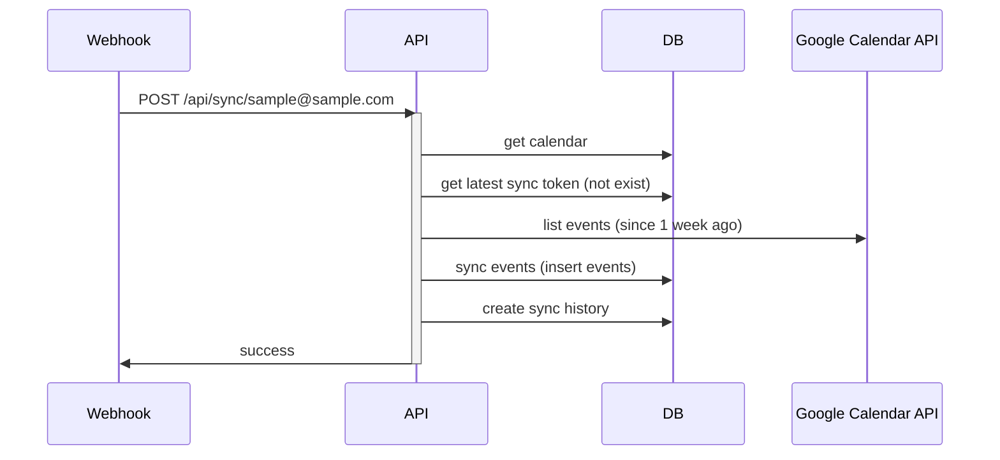
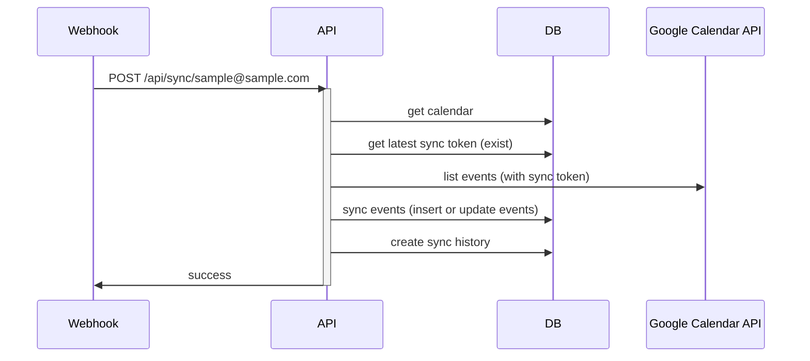

# google-calendar-sync

google-calendar-sync is a sample application for synchronizing Google Calendar events with a database.

## Requirements

- A Google Cloud service account
- A Google Calendar that the above service account can access

### For running in a local environment

- docker & docker-compose

### For running on Google Cloud

- gcloud
  - Logged in with an account that has permissions to operate Artifact Registry, Cloud Run, and other necessary services
- Cloud SQL
  - Tables defined in `db/init.sql` are created

### For development

- [oapi-codegen](https://github.com/oapi-codegen/oapi-codegen)
- mysql-client etc.

## Get Started

Clone the repository.

```sh
git clone https://github.com/takuoki/google-calendar-sync.git
cd google-calendar-sync
```

### Running in a local environment

> Note: When running in a local environment, you cannot check the operation of Watch events.

1. Place the service account key file (in JSON format) as follows.

```sh
mv [service-account-credentials.json] ./api/credentials.json
```

2. Run the application.

```sh
make run
```

3. Register the Google Calendar.

```sh
curl --location --request POST 'http://localhost:8080/api/calendars/sample@sample.com/?name=sample'
```

4. Synchronize the Google Calendar.

```sh
curl --location --request POST 'http://localhost:8080/api/sync/sample@sample.com/'
```

- The first time, all data since 1 week ago will be synchronized, and from the second time onwards, only the differential data will be synchronized.

5. Connect to the database and check the results.

```sh
mysql -h 127.0.0.1 -P 3306 -u appuser -ppassword app
```

### Running on Google Cloud

1. Create a `.env` file and modify the contents to match your environment.

```sh
cp .env_sample .env
```

2. Build and push the image to Artifact Registry.

```sh
make build
```

3. Deploy the API to Cloud Run.

```sh
make deploy
```

4. Register the Google Calendar.

```sh
curl --location --request POST 'https://your-api-url.run.app/api/calendars/sample@sample.com/?name=sample'
```

5. Start Watch for Google Calendar.

```sh
curl --location --request POST 'https://your-api-url.run.app/api/watch/sample@sample.com/'
```

## Specifications

### Sequence Diagram

#### Register the Google Calendar



#### Start Watch for Google Calendar



#### Webhook (When Watch starts)



#### Webhook (When calendar is updated)

